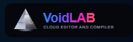
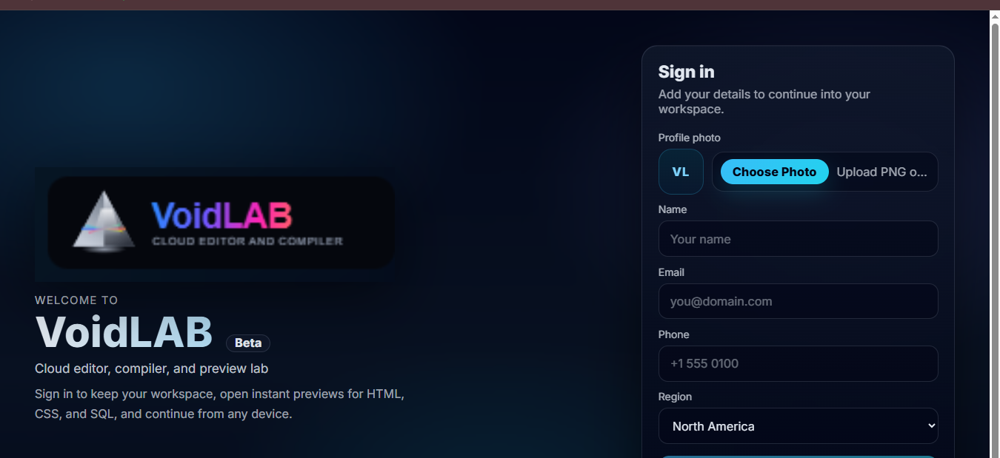
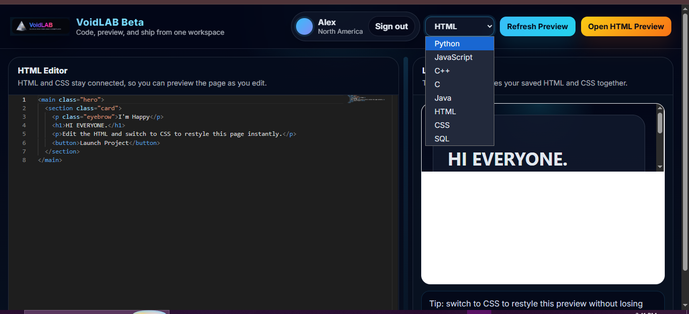

<p align="center">
  
</p>

<h1 align="center">VoidLAB Beta</h1>

<p align="center">
  A beta cloud editor and compiler for writing code, running snippets, previewing web pages, and testing SQL from one browser workspace.
</p>

<p align="center">
  <strong>React</strong> | <strong>Monaco Editor</strong> | <strong>Flask</strong> | <strong>SQLite Demo Engine</strong>
</p>

<p align="center">
  <a href="https://github.com/liambrooks-lab/VoidLAB-Beta">Repository</a>
  |
  <a href="https://void-lab-beta.vercel.app/">Product/a>
  
</p>

---

## Links

- **Repository**: [https://github.com/liambrooks-lab/VoidLAB-Beta](https://github.com/liambrooks-lab/VoidLAB-Beta)

- **Live Demo**: [https://void-lab-beta.vercel.app/](Try VoidLAB-Beta Live)


## Overview

VoidLAB Beta is a lightweight browser-based coding workspace. It gives users a clean editor, quick language switching, instant web previews, saved local code state, and backend-powered execution for multiple languages.

The goal of this beta is not to be a full production IDE yet. It is a focused product build for demos, learning, portfolio presentation, and quick coding experiments.

## Applications

VoidLAB Beta can be used as:

- an online compiler for beginner-friendly code practice
- a browser code playground for quick snippets
- a frontend preview lab for HTML and CSS experiments
- a SQL learning sandbox with demo tables
- a portfolio project that shows full-stack product thinking
- a base for a larger cloud IDE or coding platform

## Core Features

- Monaco-powered code editor
- saved code per language using browser storage
- local profile onboarding with avatar upload
- JavaScript execution directly in the browser
- Flask backend execution for Python, JavaScript, C, C++, Java, and SQL
- HTML/CSS live preview inside the app
- separate preview window for HTML, CSS, and SQL
- mobile-friendly editor/output switching
- SQL demo database with sample users, projects, and tasks

## Working Workflow

1. The user opens VoidLAB Beta.
2. The sign-in screen collects a local profile, region, and optional photo.
3. The workspace opens with the editor, output panel, language selector, and run controls.
4. The user selects a language such as Python, JavaScript, HTML, CSS, Java, C++, C, or SQL.
5. Code is written in the Monaco editor and saved locally per language.
6. Clicking `Run` executes the current code:
   - JavaScript can run directly in the browser.
   - Python, C, C++, Java, and SQL are sent to the Flask backend.
   - HTML and CSS refresh the built-in preview.
7. Output, errors, SQL results, or rendered previews appear in the right-side panel.
8. For HTML, CSS, and SQL, the user can also open a dedicated preview tab.

## Preview

<table>
  <tr>
    <td width="50%" valign="top">
      
      <br />
      <strong>1. Profile entry</strong>
      <br />
      A clean beta sign-in flow with local profile details and photo upload.
    </td>
    <td width="50%" valign="top">
      
      <br />
      <strong>2. Editor workspace</strong>
      <br />
      Language switching, Monaco editing, console output, and live preview in one workspace.
    </td>
  </tr>
</table>

## How It Works

### Frontend

The React app handles the product interface:

- sign-in/profile screen
- editor and language switching
- saved local workspace state
- browser JavaScript execution
- HTML/CSS preview rendering
- output and SQL result presentation
- communication with the backend API

### Backend

The Flask backend handles execution that needs a server runtime:

- receives language and code through `/run`
- runs Python through the current Python interpreter
- runs JavaScript through Node.js when available
- compiles and runs C/C++ when GCC/G++ are installed
- compiles and runs Java when Java tools are installed
- runs SQL against an in-memory SQLite demo database
- returns output, errors, and SQL result data to the frontend

## Language Support

### Runnable / executable

- Python
- JavaScript
- C
- C++
- Java
- SQL

### Preview focused

- HTML
- CSS

## SQL Demo Data

SQL mode includes a small in-memory demo database:

- `users(id, name, region, active)`
- `projects(id, name, owner_id, status, budget)`
- `tasks(id, project_id, title, priority, done)`

Example query:

```sql
SELECT
  p.name AS project_name,
  u.name AS owner_name,
  p.status,
  COUNT(t.id) AS total_tasks
FROM projects p
JOIN users u ON u.id = p.owner_id
LEFT JOIN tasks t ON t.project_id = p.id
GROUP BY p.id, u.name
ORDER BY p.name;
```

## Tech Stack

### Frontend

- React 18
- Monaco Editor
- Plain CSS
- LocalStorage

### Backend

- Python
- Flask
- Flask-CORS
- SQLite
- Local compiler/runtime tools where available

## Project Structure

```text
VoidLAB-Beta/
|- backend/
|  |- requirements.txt
|  `- server.py
|- docs/
|  `- readme/
|- public/
|- src/
|  |- assets/
|  |- App.js
|  |- App.css
|  |- Login.js
|  |- Login.css
|  `- WebPreview.js
|- package.json
|- LICENSE
`- README.md
```

## Local Setup

### Prerequisites

- Node.js 18+
- npm
- Python 3.10+
- Optional runtime tools for full language support:
  - Node.js for backend JavaScript execution
  - GCC for C
  - G++ for C++
  - JDK for Java

### Install frontend dependencies

```bash
npm install
```

### Start the frontend

```bash
npm start
```

Frontend URL:

```text
http://localhost:3000
```

### Start the backend

Open another terminal:

```bash
cd backend
pip install -r requirements.txt
python server.py
```

Backend URL:

```text
http://localhost:5000
```

Health check:

```text
http://localhost:5000/health
```

## Environment Variables

### Frontend

```env
REACT_APP_API_BASE_URL=http://localhost:5000
```

For hosted deployment, set this to the deployed backend URL.

### Backend

```env
PORT=5000
ALLOWED_ORIGINS=http://localhost:3000
```

For hosted deployment, set `ALLOWED_ORIGINS` to the deployed frontend URL.

## Deployment Plan

A simple beta deployment path:

- deploy the React frontend on Vercel, Netlify, or GitHub Pages
- deploy the Flask backend on Render, Railway, or a custom server
- set `REACT_APP_API_BASE_URL` in the frontend host
- set `ALLOWED_ORIGINS` in the backend host

HTML, CSS, SQL, Python, and browser JavaScript are the smoothest hosted paths. C, C++, and Java depend on compiler toolchains being installed on the backend machine, so hosted production support for those languages is best handled with a custom container image.

## Current Beta Scope

VoidLAB Beta is ready for demos, experiments, learning workflows, and portfolio presentation. It is still a beta product, so future improvements can include:

- public hosted demo
- stronger authentication
- cloud project saving
- file import/export
- better execution sandboxing
- richer terminal-style output
- more project and workspace tools

## License

VoidLAB Beta is protected under a custom restricted license.

Copyright (c) 2026 Rudranarayan Jena.

This project is not released as an open-source project under MIT, Apache, GPL, or any other permissive/public license. Copying, modification, distribution, hosting, reuse, or derivative work requires prior written permission from the author.

See [LICENSE](LICENSE) for the full license text.

## Author

<p align="center">
  
</p>

<p align="center">
  <strong>Crafted by MR. Rudranarayan Jena</strong>
</p>

<p align="center">
  Product Builder | Full-stack Developer | Creator of VoidLAB Beta
</p>

<p align="center">
  <a href="https://github.com/liambrooks-lab">GitHub: @liambrooks-lab</a>
</p>
